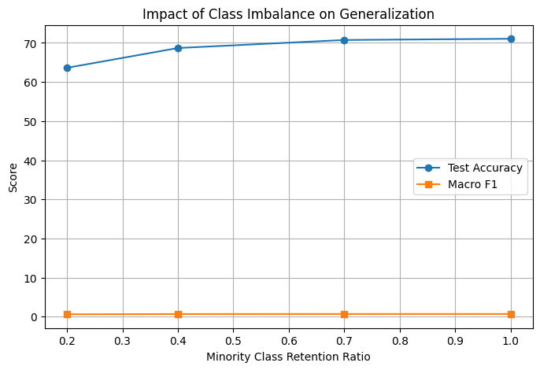

# Class Imbalance and CNN Generalization

## Overview
This repository contains a research oriented experimental study examining how varying levels of class imbalance affect the generalization behavior of a convolutional neural network (CNN) in a multi class image classification task. Using a fixed CNN architecture and training pipeline, controlled experiments are conducted by systematically reducing minority class representation while holding all other factors constant. Model performance is evaluated using both aggregate and class wise metrics to assess how imbalance influences generalization beyond overall accuracy.

## Motivation
Class imbalance is a common characteristic of real world datasets, yet many standard training pipelines are evaluated primarily using aggregate accuracy on balanced benchmarks. While accuracy provides a coarse measure of performance, it can obscure systematic degradation in underrepresented classes. This project aims to empirically investigate how increasing degrees of class imbalance impact CNN generalization and to highlight the limitations of accuracy only evaluation by contrasting it with class sensitive metrics.

## Experimental Setup

### Dataset
All experiments are conducted using the CIFAR-10 dataset, which consists of 50,000 training images and 10,000 test images across 10 object classes. Images are resized to 32×32 resolution and normalized using standard channel wise normalization. The test set is kept fixed across all experiments to ensure consistent evaluation.

### Model Architecture
A simple convolutional neural network (CNN) is implemented using PyTorch. The architecture consists of two convolutional layers with ReLU activations and max-pooling, followed by fully connected layers for classification. The same architecture is used across all experiments to isolate the effect of data imbalance from model complexity.

### Training Procedure
Models are trained using cross entropy loss and the Adam optimizer with a fixed learning rate. For each experiment, the model is initialized from scratch and trained for a fixed number of epochs. Random seeds are set to ensure reproducibility, and no data augmentation or imbalance mitigation techniques are applied.

### Class Imbalance Design
Class imbalance is introduced by selectively reducing the number of training samples for a subset of classes while retaining the full dataset for the remaining classes. Four imbalance regimes are evaluated: 100%, 70%, 40%, and 20% minority class retention. Apart from the class distribution, all training and evaluation settings remain unchanged across experiments.

### Evaluation Metrics
Model performance is evaluated using overall classification accuracy and macro-averaged F1 score. While accuracy reflects aggregate performance, macro-F1 assigns equal weight to each class and provides a more informative measure of class-wise generalization under imbalanced data distributions.

## Key Findings
Across all experiments, increasing class imbalance led to a gradual decline in overall classification accuracy, while class wise performance degraded more sharply. In particular, macro averaged F1 score revealed earlier and more consistent performance loss compared to aggregate accuracy, indicating that accuracy alone can mask degradation in minority class predictions. Training accuracy remained high across imbalance regimes, suggesting that the observed performance decline is driven by biased learning toward majority classes rather than underfitting.

## Results
The figure below summarizes the relationship between minority class retention and model performance. While test accuracy decreases gradually as imbalance increases, macro averaged F1 score exhibits a more pronounced decline, highlighting differences between aggregate and class sensitive evaluation metrics under imbalanced data distributions.

## Limitations
This study focuses on a single CNN architecture and a standard cross-entropy training objective without incorporating imbalance-aware techniques such as class weighting, resampling, or cost-sensitive losses. The intent is not to propose a mitigation strategy, but to isolate and analyze the effect of class imbalance on standard training pipelines. Results may vary with different architectures, datasets, or training objectives.

## Reproducibility
All experiments can be reproduced by running the `experiments.ipynb` notebook. Dependencies are listed in `requirements.txt`. The CIFAR-10 dataset is automatically downloaded via torchvision during execution. Random seeds are fixed to ensure consistent results across runs.
