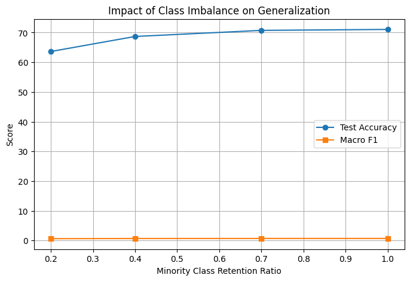

# Class Imbalance and CNN Generalization

## Overview
This repository contains a controlled experimental study examining how varying levels of class imbalance affect the generalization behavior of a convolutional neural network (CNN) in a multi-class image classification task.

A fixed CNN architecture and training pipeline are used across all experiments. Class imbalance is introduced systematically by reducing minority class representation while keeping all other factors unchanged. This design isolates imbalance as the primary experimental variable. Model performance is evaluated using both aggregate and class-wise metrics to examine how imbalance influences generalization beyond overall accuracy.

---

## Motivation
Class imbalance is a common property of real-world datasets, particularly in settings where rare events carry meaningful consequences. Despite this, many training pipelines are evaluated primarily using aggregate accuracy on balanced benchmarks.

Accuracy provides a coarse summary of performance, but it can obscure systematic degradation in underrepresented classes. This study investigates how increasing levels of class imbalance influence CNN generalization and highlights the limitations of accuracy-only evaluation by contrasting it with class-sensitive metrics.

The goal of this project is not to propose new algorithms, but to carefully characterize model behavior under controlled imbalance conditions.

---

## Experimental Setup

### Dataset
All experiments are conducted using the CIFAR-10 dataset, consisting of:

- 50,000 training images  
- 10,000 test images  
- 10 object classes  

Images are resized to 32×32 resolution and normalized using standard channel-wise normalization. The test set is kept fixed across all experiments to ensure consistent evaluation.

---

### Model Architecture
A simple convolutional neural network (CNN) is implemented using PyTorch. The architecture consists of:

- Two convolutional layers with ReLU activations  
- Max-pooling operations  
- Fully connected classification layers  

Architectural complexity is intentionally limited so that performance differences reflect changes in data distribution rather than changes in model capacity.

---

### Training Procedure
Models are trained using:

- Cross-entropy loss  
- Adam optimizer  
- Fixed learning rate  
- Fixed number of epochs  

For each experiment:

- The model is initialized from scratch  
- Random seeds are fixed for reproducibility  
- No data augmentation or imbalance mitigation techniques are applied  

This ensures that differences in performance arise solely from the imposed imbalance.

---

### Class Imbalance Design
Class imbalance is introduced by selectively reducing the number of training samples for a subset of classes while keeping the remaining classes unchanged.

Four imbalance regimes are evaluated:

- **100%** — Fully balanced  
- **70%** — Moderate imbalance  
- **40%** — Strong imbalance  
- **20%** — Severe imbalance  

All other training and evaluation settings remain identical across regimes.

---

### Evaluation Metrics
Model performance is evaluated using:

- **Overall Accuracy**  
- **Macro-Averaged F1 Score**

Accuracy measures aggregate correctness across all predictions. Macro-F1 assigns equal weight to each class and therefore provides a more sensitive measure of performance degradation under imbalance.

These metrics are reported together to contrast aggregate performance with class-level behavior.

---

## Key Findings
Across all experiments, increasing class imbalance produced consistent degradation in model performance.

Several patterns were observed:

- Overall classification accuracy declined gradually as imbalance increased  
- Class-wise performance degraded more sharply than aggregate accuracy  
- Macro-averaged F1 revealed performance loss earlier than accuracy  
- Training accuracy remained high across imbalance regimes  

The persistence of high training accuracy alongside declining test performance suggests that performance degradation arises from biased learning toward majority classes rather than insufficient model capacity.

---

## Results

The figure below summarizes the relationship between minority class retention and model performance.

While test accuracy decreases gradually with increasing imbalance, macro-averaged F1 shows a steeper decline, indicating that class-sensitive metrics reveal performance failures earlier than aggregate accuracy.



---

## Research Report

A detailed experimental report describing methodology, observations, and validation steps is included in the repository.

📄 **Full Report:**  
[Impact of Class Imbalance on CNN Generalization](report/Impact_of_Class_Imbalance_on_CNN_Generalization.pdf)

The report includes:

- Controlled imbalance construction  
- Reliability analysis of model behavior  
- Failure analysis and debugging validation  
- Interpretation of asymmetric performance degradation  
- Discussion of limitations and future directions  

---

## Limitations
This study intentionally focuses on a simplified setting in order to isolate the effects of class imbalance.

Several limitations should be noted:

- Only a single CNN architecture is evaluated  
- A standard cross-entropy objective is used  
- No imbalance-aware techniques are applied  
- Experiments are conducted on a single benchmark dataset  

The purpose of this work is analytical rather than prescriptive. Results may differ when using deeper architectures, alternative datasets, or specialized imbalance-handling methods.

---

## Reproducibility

All experiments can be reproduced using:

```bash
experiments.ipynb
